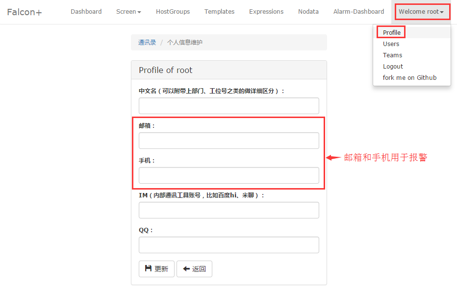
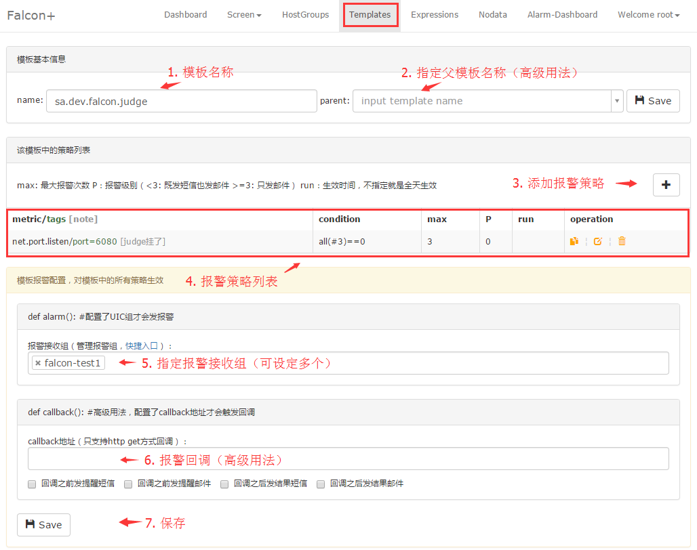

系统搭建好了，应该如何用起来，这节给大家逐步介绍一下

# 查看监控数据

我们说agent只要部署到机器上，并且配置好了heartbeat和transfer就自动采集数据了，我们就可以去dashboard上面搜索监控数据查看了。dashboard是个web项目，浏览器访问之。左侧输入endpoint搜索，endpoint是什么？应该用什么搜索？对于agent采集的数据，endpoint都是机器名，去目标机器上执行`hostname`，看到的输出就是endpoint，拿着hostname去搜索。

搜索到了吧？嗯，选中前面的复选框，点击“查看counter列表”，可以列出隶属于这个endpoint的counter，counter是什么？`counter=${metric}/sorted(${tags})`

假如我们要查看cpu.busy，在counter搜索框中输入cpu并回车。看到cpu.busy了吧，点击，会看到一个新页面，图表中就是这个机器的cpu.busy的近一小时数据了，想看更长时间的？右上角有个小三角，展开菜单，可以选择更长的时间跨度

- - - - -

# 如何配置报警策略

上节我们已经了解到如何查看监控数据了，如果数据达到阈值，比如cpu.busy太大的时候，我们应该如何配置告警呢？

## 配置报警接收人

falcon的报警接收人不是一个具体的手机号，也不是一个具体的邮箱，因为手机号、邮箱都是容易发生变化的，如果变化了去修改所有相关配置那就太麻烦了。我们把用户的联系信息维护在一个叫 `帐户/Profile` 里，以后如果要修改手机号、邮箱，只要修改自己的帐户信息即可。报警接收人也不是单个的人，而是一个组（Teams），比如falcon这个系统的任何组件出问题了，都应该发报警给falcon的运维和开发人员，发给falcon这个团队，这样一来，新员工入职只要加入falcon这个Team即可；员工离职，只要从falcon这个Team删掉即可。

浏览器访问UIC，如果启用了LDAP，那就用LDAP账号登陆，如果没有启用，那就注册一个或者找管理员帮忙开通。创建一个Team，名称姑且叫falcon，把自己加进去，待会用来做测试。

首先修改帐户信息，保证邮箱和手机号正确

然后添加报警组，添加成员

- - - - 

## 创建HostGroup

比如我们要对falcon-judge这个组件做端口监控，那首先创建一个HostGroup，把所有部署了falcon-judge这个模块的机器都塞进去，以后要扩容或下线机器的时候直接从这个HostGroup增删机器即可，报警策略会自动生效、失效。咱们为这个HostGroup取名为：sa.dev.falcon.judge，这个名称有讲究，sa是我们部门，dev是我们组，falcon是项目名，judge是组件名，传达出了很多信息，这样命名比较容易管理，推荐大家这么做。

在往组里加机器的时候如果报错，需要检查portal的数据库中host表，看里边是否有相关机器。那host表中的机器从哪里来呢？agent有个heartbeat(hbs)的配置，agent每分钟会发心跳给hbs，把自己的ip、hostname、agent version等信息告诉hbs，hbs负责写入host表。如果host表中没数据，需要检查这条链路是否通畅。

## 创建策略模板

portal最上面有个Templates链接，这就是策略模板管理的入口。我们进去之后创建一个模板，名称姑且也叫：sa.dev.falcon.judge.tpl，与HostGroup名称相同，在里边配置一个端口监控，通常进程监控有两种手段，一个是进程本身是否存活，一个是端口是否在监听，此处我们使用端口监控。

- - - - -

右上角那个加号按钮是用于增加策略的，一个模板中可以有多个策略，此处我们只添加了一个。下面可以配置报警接收人，此处填写的是falcon，这是之前在UIC中创建的Team。

## 将HostGroup与模板绑定

一个模板是可以绑定到多个HostGroup的，现在我们重新回到HostGroups页面，找到sa.dev.falcon.judge这个HostGroup，右侧有几个超链接，点击【templates】进入一个新页面，输入模板名称，绑定一下就行了。

- - - - -

## 补充

上面步骤做完了，也就配置完了。如果judge组件宕机，端口不再监听了，就会报警。不过大家不要为了测试报警效果，直接把judge组件给干掉了，因为judge本身就是负责判断报警的，把它干掉了，那就没法判断了……所以说falcon现在并不完善，没法用来监控本身的组件。为了测试，大家可以修改一下端口监控的策略配置，改成一个没有在监听的端口，这样就触发报警了。

上面的策略只是对falcon-judge做了端口监控，那如果我们要对falcon这个项目的所有机器加一些负载监控，应该如何做呢？

1. 创建一个HostGroup：sa.dev.falcon，把所有falcon的机器都塞进去
2. 创建一个模板：sa.dev.falcon.common，添加一些像ping, df.bytes.free.percent, load.5min等策略
3. 将sa.dev.falcon.common绑定到sa.dev.falcon这个HostGroup

附：sa.dev.falcon.common的配置样例

大家可能不知道各个指标分别叫什么，自己push的数据肯定知道自己的metric了，agent push的数据可以参考：https://github.com/open-falcon/agent/tree/master/funcs 

# 如何配置策略表达式

策略表达式，即expression，具体可以参考 [HostGroup与Tags设计理念](../philosophy/tags-and-hostgroup.md)，这里只是举个例子：

上例中的配置传达出的意思是：endpoint=aggregator 并且 metric=cpu.busy 的所有的监控指标，只要连续3次 >= 0.5 则报警给`falcon-test1`这个报警组。

expression无需绑定到HostGroup，enjoy it