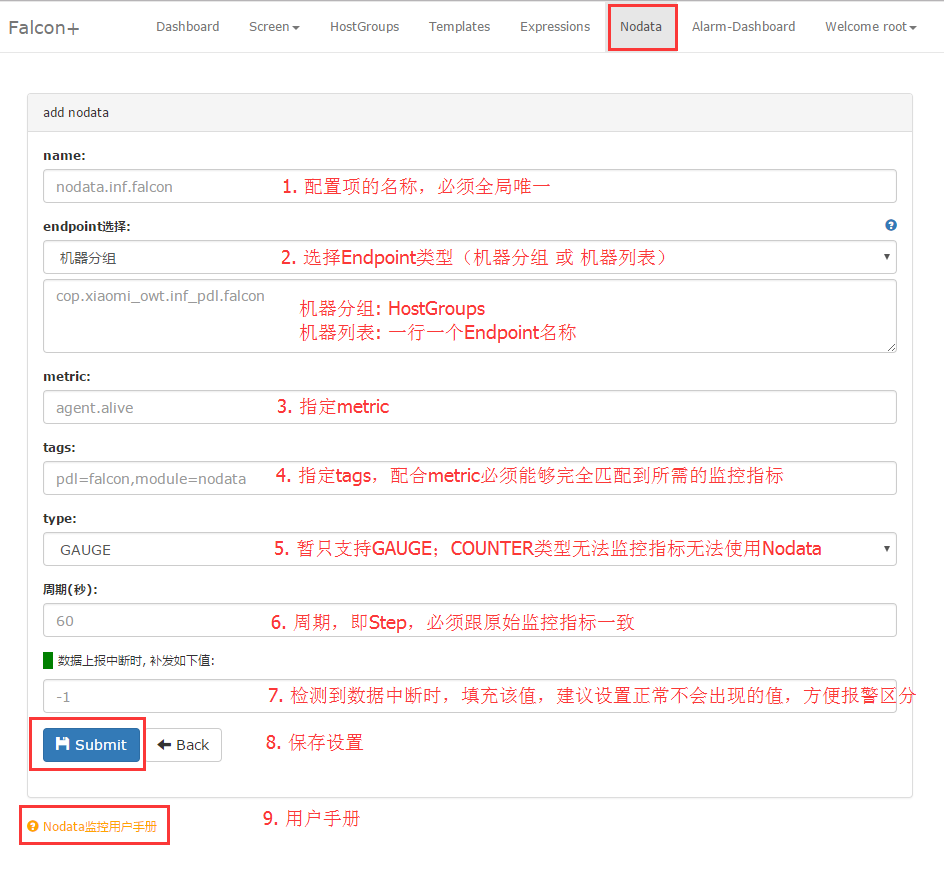

# Nodata配置
使用Nodata，需要进行两个配置: Nodata配置 和 策略配置。下面，我们以一个例子，讲述如何使用Nodata提供的服务。

### 用户需求
当机器分组`cop.xiaomi_owt.inf_pdl.falcon`下的所有机器，其采集指标 `agent.alive` 上报中断时，通知用户。

### Nodata配置
进入Nodata配置主页，可以看到Nodata配置列表

点击右上角的添加按钮，添加nodata配置。

进行完上述配置后，分组`cop.xiaomi_owt.inf_pdl.falcon`下的所有机器，其采集项 `agent.alive`上报中断后，nodata服务就会补发一个取值为 `-1.0`、agent.alive的监控数据给监控系统。

### 策略配置
配置了Nodata后，如果有数据上报中断的情况，Nodata配置中的默认值就会被上报。我们可以针对这个默认值，设置报警；只要收到了默认值，就认为发生了数据上报的中断（如果你设置的默认值，可能与正常上报的数据相等，那么请修改你的Nodata配置、使默认值有别于正常值）。将此策略，绑定到分组`cop.xiaomi_owt.inf_pdl.falcon`即可。

### 注意事项
1. 配置名称name，要全局唯一。这是为了方便Nodata配置的管理。
2. 监控实例endpoint, 可以是机器分组、机器名或者其他 这三种类型，只能选择其中的一种。同一类型，支持多个记录，但建议不超过5个，多条记录换行分割、每行一条记录。选择机器分组时，系统会帮忙展开成具体机器名，支持动态生效。监控实体不是机器名时，只能选择“其他”类型。
3. 监控指标metric。
4. 数据标签tags，多个tag要用逗号隔开。必须填写完整的tags串，因为nodata会按照此tags串，去完全匹配、筛选监控数指标项。
5. 数据类型type，只支持原始值类型GAUGE。因为，nodata只应该监控 "特征指标"(如agent.alive)，"特征指标"都是GAUGE类型的。
6. 采集周期step，单位是秒。必须填写 完整&真实step。该字段不完整 或者 不真实，将会导致nodata监控的误报、漏报。
7. 补发值default，必须有别于上报的真实数据。比如，`cpu.idle`的取值范围是[0,100]，那么它的nodata默认取值 只能取小于0或者大于100的值。否则，会发生误报、漏报。
